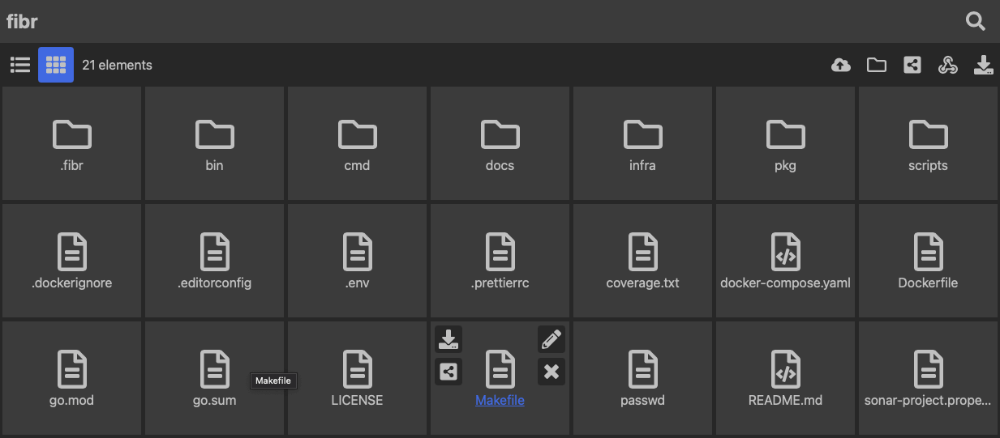
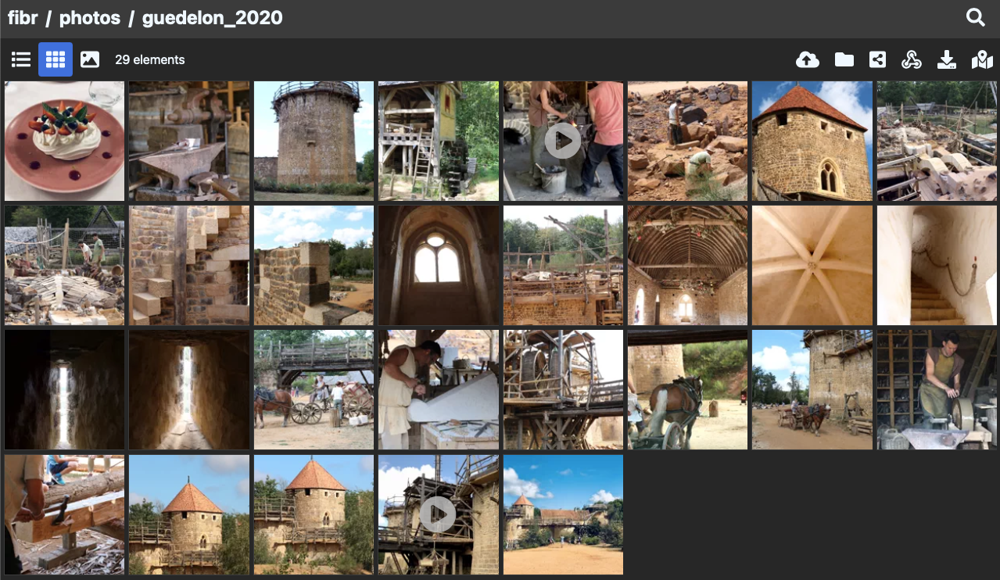
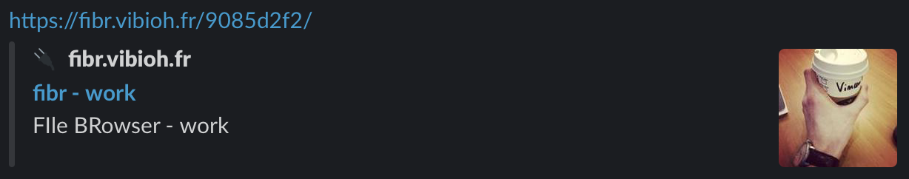

# fibr

Web File Browser and Manager.

- Mobile-first interface, with light payload. Dark themed.
- Thumbnail generation for image, PDF and video (with help of sidecars)
- Exif extraction and displaying content on a map (with help of sidecars)
- Works in pure HTML or with very little javascript for improved file upload
- Support for basic filesystem and storage object
- Can share directory with ou without password and with or without edit right.
- Can communicate with sidecars in pure HTTP or AMQP
- Can send webhooks for different event types to various providers
- Basic search for files on metadatas without indexation
- OpenTelemetry and pprof already built-in





[](https://github.com/ViBiOh/fibr/actions)

Thanks to [FontAwesome](https://fontawesome.com) and [Lucide](https://lucide.dev) for providing awesome svg icons.

I do it mostly for myself, but if you want to support me, you can star this project to give more visibility, that will bring more features =)

## Concepts

Fibr aims to provide simple browsing of your filesystem. It's a single static binary with embedded html templates. No Javascript framework. HTTP and HTML have all we need.

Fibr aims to be compatible with the most platforms available, on a best-effort basis. Fibr itself is already compatible with `x86_64`, `arm`, `arm64` architectures. But sidecars, which depends on system library, are not all ready yet.

### Folder

Fibr browses files of given `-data` option folder (or S3 configuration), called "root folder". For security reason, it's not possible to browse parent.

It aims to be consistent accross all existing filesystem (block storage, object storage, etc.) and thus enforces filenames in lowercase, with no space or special character. At start, it walks every files and reports names that breaks its policy. It doesn't modify existing files unless you set `-sanitizeOnStart` option.

Fibr creates a `.fibr` folder in _root folder_ for storing its metadata: shares' configuration, thumbnails and exif. If you want to stop using _fibr_ or start with a fresh installation (e.g. regenerating thumbnails), you can delete this folder.

### Sidecars

Fibr generates thumbnails of images, PDF and videos when these [mime-types are detected](https://developer.mozilla.org/en-US/docs/Web/HTTP/Basics_of_HTTP/MIME_types/Common_types) and sidecars are provided. Sidecars are [ViBiOh/vignet](https://github.com/vibioh/vignet) and [ViBiOh/exas](https://github.com/vibioh/exas). Thumbnails are generated in [WebP](https://developers.google.com/speed/webp/) format, in their animated format for video thumbnail.

You can refer to these projects for installing and configuring them and set `-thumbnailURL` and `-exifURL` options.

Sidecars may have constraints regarding concurrent work (e.g. HLS conversion is a CPU-intensive task) or rate limit (e.g. geocoding can have rate-limiting). Call to these sidecars can be made with HTTP, which is not fault tolerant but easy to setup, or with an AMQP messaging, which is more resilient but more complex to setup. An easy-to-setup AMQP messaging instance can be done with [CloudAMQP](https://www.cloudamqp.com) (I have no affiliation of any kind to this company, just a happy customer). When AMQP connection URI is provided, Fibr will use it as default communication protocol instead of HTTP.

#### HTTP Live Streaming

Fibr has a special treatment for videos, that can be very large sometimes. With the help of the `vignet` sidecar, it can convert a video to its [HLS version](https://en.wikipedia.org/wiki/HTTP_Live_Streaming). It keeps the original video as is, and stores streamable version in the metadatas directory. It's a basic conversion into the appropriate format: no resolution, frame-per-second or any quality specifications are changed. Conversion is done where this two requirements are met altogether:

- `vignet` is configured with direct access to the filesystem (see [`vignet`documentation about configuring `WorkDir`](https://github.com/vibioh/vignet#usage) and [`fibr` configuration](#usage) for enabling it). Direct access disable large file transfer in the network.
- the video bitrate is above [`thumbnailMinBitrate (default 80000000)`](#usage)

### Chunk upload

Fibr supports uploading file by chunks or in one single request. This behavior is managed by the [`-chunkUpload`](#usage) option. In both cases, the file are written directly to the disk without buffering in memory. If you have a load-balancer in front of your Fibr instances, chunk upload requires that you enable sticky sessions because file are written locally to the `-temporaryFolder` before being written to the destination folder. On the other hand, when using one single request, you may need to tune the `-readTimeout` option to ensure that a slow connection with a big file can fullfil the request within the allowed timeout window.

In case of failure, when using one single request, all the upload is started from the beginning. In case of a chunk upload, the upload restarts from the failed chunk.

### Security

Authentication is made with [Basic Auth](https://developer.mozilla.org/en-US/docs/Web/HTTP/Authentication), compatible with all browsers and CLI tools such as `curl`. I **strongly recommend configuring HTTPS** in order to avoid exposing your credentials in plain text.

You can set `-cert` and `-key` options, it uses [Golang's standard net/http#ServeTLS](https://golang.org/pkg/net/http/#ServeTLS) under the hood.

You can also configure a reverse proxy with Let's Encrypt to manage encryption, such as [Traefik](https://docs.traefik.io).

### Sharing

You can share folders or just one file: it generates a short link that gain access to shared object and is considered as "root folder" with no parent escalation.

It can be password-protected: user **has to** enter password to see content (login is not used, you can leave it blank).

It can be read-only or with edit right. With edit-right, user can do anything as you, uploading, deleting, renaming, except generating new shares.

It can be created with expiration duration.

> It's really useful for sharing files with friends. You don't need account at Google, Dropbox, iCloud or a mobile-app: a link and everyone can see and share content!

This is the main reason I've started to develop this app.

### Webhook

You can register webhook listeners on folders and receive an HTTP notification when one of these event occurs:

- `create` occurs when a directory is created
- `upload` occurs when an item is uploaded
- `rename` occurs when an item is renamed
- `delete` occurs when an item is deleted
- `start` occurs when fibr start and do something on an item
- `access` occurs when content is accessed (directory browsing or just one file)
- `description` occurs when a description is written on the story mode

The request sent is a POST with 15s timeout with the given payload structure:

```json
{
  "time": "2021-02-25:12:32.244914+01:00",
  "url": "/eventual_share_id/path/to/payload.json",
  "item": {
    "date": "2021-08-10T19:31:28.952325533Z",
    "name": "payload.json",
    "pathname": "/path/to/payload.json",
    "isDir": false,
    "size": 177
  },
  "metadata": {
    "description": "content"
  },
  "type": "upload"
}
```

It will contains an extra key `new` with the same structure of `item` in case of a `rename` event, and a `metadata` map in case of `access` event, that contains a dump of HTTP Header (except `Authorization`).

The webhook can be recursive (all children folders will be notified too) for event choosen.

#### Security

Webhooks can be sent with an [HTTP Signature](https://datatracker.ietf.org/doc/html/draft-cavage-http-signatures-12) if you configure the [`webhookSecret`](#usage). It adds an `Authorization` header to the sent request that serves as an authentification mechanism for the receiver: if the signature is not valid, you should not trust the caller.

I've implemented a [very simple function](https://github.com/ViBiOh/httputils/blob/main/pkg/request/signature.go#L34) you can add to your receiver for checking it.

### SEO

Fibr provides [OpenGraph metadatas](https://ogp.me) to have nice preview of link when shared. These metadatas don't leak any password-protected datas.



### Users

You can start `fibr` with no user, with the `-noAuth` option. Although available, I don't recommend using it in public Internet. Anybody has access to the _root folder_ for viewing, uploading, deleting or sharing content with anybody.

Users are set with the `-authUsers` option and are in the form `[id]:[login]:[argon encoded hash]`.

- `id` is used to add profile to your user
- `login` is the user for Basic Auth prompt
- `argon encoded hash` is the password for Basic Auth prompt, [encoded hash with `argon2id`](https://en.wikipedia.org/wiki/Argon2)

You can easily hash your password value with my own [`argon CLI`](https://github.com/ViBiOh/auth/blob/main/cmd/argon/argon.go) or [online](https://argon2.online).

```bash
argon password
```

In order to work, your user **must have** `admin` profile sets with the `-authProfiles` option.

### Metadatas

With help of different sidecars, Fibr can generate image, video and PDF thumbnails. These sidecars can be self hosted with ease. It can also extract and enrich content displayed by looking at [EXIF Data](https://en.wikipedia.org/wiki/Exif), also with the help of a little sidecar. These behaviours are opt-out (if you remove the `url` of the service, Fibr will do nothing).

For the last mile, Fibr can try to reverse geocoding the GPS data found in EXIF, using [Open Street Map](https://wiki.openstreetmap.org/wiki/Nominatim). Self-hosting this kind of service can be complicated and calling a third-party party with such sensible datas is an opt-in decision.

### Metrics

Fibr exposes a lot of metrics via OpenTelemetry gRPC mode. Common metrics are exposed: Golang statistics, HTTP statuses and response time, AMQP statuses and sidecars/metadatas actions.

## Getting started

### As a binary, without authentification

This is for local purpose with simple and hassle-free sharing in a private network.

```bash
go install github.com/ViBiOh/fibr/cmd/fibr@latest
fibr \
  -noAuth \
  -storageFileSystemDirectory "$(pwd)" \
  -thumbnailURL "" \
  -exifURL ""
```

### As a single Docker container, with admin/password user

For long-living sharing with password and self-contained app in Docker, with no thumbnail generation or exif, configured with environment variables.

```bash
docker run -d \
  --publish 1080:1080/tcp \
  --name fibr \
  --volume ${PWD}:/data/ \
  --env FIBR_AUTH_USERS="1:$(htpasswd -nBb login password)" \
  --env FIBR_THUMBNAIL_URL="" \
  --env FIBR_EXIF_URL="" \
  vibioh/fibr
```

### As a docker-compose / k8s stack

For prod-ready run with thumbnails generation of image, PDF and videos, _this is the recommended approach_.

You can inspire yourself from the [docker-compose.yaml](docker-compose.yaml) file I personnaly used. Beware of `-authUsers` option: hashed passwords contain dollar sign, which `docker-compose` tries to resolve as a shell variable, [you must escape it](https://docs.docker.com/compose/compose-file/compose-file-v2/#variable-substitution).

```bash
make config-compose
docker compose --env-file ".env.compose" up
```

You'll find a Kubernetes exemple in the [`infra/`](infra) folder, using my [`app chart`](https://github.com/ViBiOh/charts/tree/main/app). My personnal k8s runs on `arm64` and thumbnail converters are not yet ready for this architecture, so I use a mix of `helm` and `docker-compose.yaml`.

## Endpoints

- `GET /health`: healthcheck of server, always respond [`okStatus (default 204)`](#usage)
- `GET /ready`: checks external dependencies availability and then respond [`okStatus (default 204)`](#usage) or `503` during [`graceDuration`](#usage) when close signal is received
- `GET /version`: value of `VERSION` environment variable

## Usage

Fibr can be configured by passing CLI args described below or their equivalent as environment variable. If both the CLI and environment variable are defined, the CLI value is used.

Be careful when using the CLI, if someone list the processes on the system, they will appear in plain-text. I recommend passing secrets by environment variables: it's less easily visible.

```bash
Usage of fibr:
  --address                           string        [server] Listen address ${FIBR_ADDRESS}
  --amqpExifExchange                  string        [amqpExif] Exchange name ${FIBR_AMQP_EXIF_EXCHANGE} (default "fibr")
  --amqpExifExclusive                               [amqpExif] Queue exclusive mode (for fanout exchange) ${FIBR_AMQP_EXIF_EXCLUSIVE} (default false)
  --amqpExifInactiveTimeout           duration      [amqpExif] When inactive during the given timeout, stop listening ${FIBR_AMQP_EXIF_INACTIVE_TIMEOUT} (default 0s)
  --amqpExifMaxRetry                  uint          [amqpExif] Max send retries ${FIBR_AMQP_EXIF_MAX_RETRY} (default 3)
  --amqpExifQueue                     string        [amqpExif] Queue name ${FIBR_AMQP_EXIF_QUEUE} (default "fibr.exif")
  --amqpExifRetryInterval             duration      [amqpExif] Interval duration when send fails ${FIBR_AMQP_EXIF_RETRY_INTERVAL} (default 1h0m0s)
  --amqpExifRoutingKey                string        [amqpExif] RoutingKey name ${FIBR_AMQP_EXIF_ROUTING_KEY} (default "exif_output")
  --amqpPrefetch                      int           [amqp] Prefetch count for QoS ${FIBR_AMQP_PREFETCH} (default 1)
  --amqpThumbnailExchange             string        [amqpThumbnail] Exchange name ${FIBR_AMQP_THUMBNAIL_EXCHANGE} (default "fibr")
  --amqpThumbnailExclusive                          [amqpThumbnail] Queue exclusive mode (for fanout exchange) ${FIBR_AMQP_THUMBNAIL_EXCLUSIVE} (default false)
  --amqpThumbnailInactiveTimeout      duration      [amqpThumbnail] When inactive during the given timeout, stop listening ${FIBR_AMQP_THUMBNAIL_INACTIVE_TIMEOUT} (default 0s)
  --amqpThumbnailMaxRetry             uint          [amqpThumbnail] Max send retries ${FIBR_AMQP_THUMBNAIL_MAX_RETRY} (default 3)
  --amqpThumbnailQueue                string        [amqpThumbnail] Queue name ${FIBR_AMQP_THUMBNAIL_QUEUE} (default "fibr.thumbnail")
  --amqpThumbnailRetryInterval        duration      [amqpThumbnail] Interval duration when send fails ${FIBR_AMQP_THUMBNAIL_RETRY_INTERVAL} (default 1h0m0s)
  --amqpThumbnailRoutingKey           string        [amqpThumbnail] RoutingKey name ${FIBR_AMQP_THUMBNAIL_ROUTING_KEY} (default "thumbnail_output")
  --amqpURI                           string        [amqp] Address in the form amqps?://<user>:<password>@<address>:<port>/<vhost> ${FIBR_AMQP_URI}
  --authProfiles                      string slice  [auth] Users profiles in the form 'id:profile1|profile2' ${FIBR_AUTH_PROFILES}, as a string slice, environment variable separated by "," (default [1:admin])
  --authUsers                         string slice  [auth] Users credentials in the form 'id:login:password' ${FIBR_AUTH_USERS}, as a string slice, environment variable separated by "|"
  --cert                              string        [server] Certificate file ${FIBR_CERT}
  --chunkUpload                                     [crud] Use chunk upload in browser ${FIBR_CHUNK_UPLOAD} (default false)
  --csp                               string        [owasp] Content-Security-Policy ${FIBR_CSP} (default "default-src 'self'; base-uri 'self'; script-src 'self' 'httputils-nonce' unpkg.com/webp-hero@0.0.2/dist-cjs/ unpkg.com/leaflet@1.9.4/dist/ unpkg.com/leaflet.markercluster@1.5.1/ cdn.jsdelivr.net/npm/pdfjs-dist@5.3.31/; style-src 'self' 'httputils-nonce' unpkg.com/leaflet@1.9.4/dist/ unpkg.com/leaflet.markercluster@1.5.1/; img-src 'self' data: a.tile.openstreetmap.org b.tile.openstreetmap.org c.tile.openstreetmap.org; worker-src blob:")
  --exifAmqpExchange                  string        [exif] AMQP Exchange Name ${FIBR_EXIF_AMQP_EXCHANGE} (default "fibr")
  --exifAmqpRoutingKey                string        [exif] AMQP Routing Key for exif ${FIBR_EXIF_AMQP_ROUTING_KEY} (default "exif_input")
  --exifDirectAccess                                [exif] Use Exas with direct access to filesystem (no large file upload, send a GET request, Basic Auth recommended) ${FIBR_EXIF_DIRECT_ACCESS} (default false)
  --exifMaxSize                       int           [exif] Max file size (in bytes) for extracting exif (0 to no limit). Not used if DirectAccess enabled. ${FIBR_EXIF_MAX_SIZE} (default 209715200)
  --exifPassword                      string        [exif] Exif Tool URL Basic Password ${FIBR_EXIF_PASSWORD}
  --exifURL                           string        [exif] Exif Tool URL (exas) ${FIBR_EXIF_URL} (default "http://exas:1080")
  --exifUser                          string        [exif] Exif Tool URL Basic User ${FIBR_EXIF_USER}
  --extension                         string        Go Template Extension ${FIBR_EXTENSION} (default "tmpl")
  --frameOptions                      string        [owasp] X-Frame-Options ${FIBR_FRAME_OPTIONS} (default "SAMEORIGIN")
  --graceDuration                     duration      [http] Grace duration when signal received ${FIBR_GRACE_DURATION} (default 30s)
  --hsts                                            [owasp] Indicate Strict Transport Security ${FIBR_HSTS} (default true)
  --idleTimeout                       duration      [server] Idle Timeout ${FIBR_IDLE_TIMEOUT} (default 2m0s)
  --ignorePattern                     string        [crud] Ignore pattern when listing files or directory ${FIBR_IGNORE_PATTERN}
  --key                               string        [server] Key file ${FIBR_KEY}
  --loggerJson                                      [logger] Log format as JSON ${FIBR_LOGGER_JSON} (default false)
  --loggerLevel                       string        [logger] Logger level ${FIBR_LOGGER_LEVEL} (default "INFO")
  --loggerLevelKey                    string        [logger] Key for level in JSON ${FIBR_LOGGER_LEVEL_KEY} (default "level")
  --loggerMessageKey                  string        [logger] Key for message in JSON ${FIBR_LOGGER_MESSAGE_KEY} (default "msg")
  --loggerTimeKey                     string        [logger] Key for timestamp in JSON ${FIBR_LOGGER_TIME_KEY} (default "time")
  --minify                                          Minify HTML ${FIBR_MINIFY} (default true)
  --name                              string        [server] Name ${FIBR_NAME} (default "http")
  --noAuth                                          [auth] Disable basic authentification ${FIBR_NO_AUTH} (default false)
  --noStorageTrace                                  [storage] Disable tracing for storage ${FIBR_NO_STORAGE_TRACE} (default false)
  --okStatus                          int           [http] Healthy HTTP Status code ${FIBR_OK_STATUS} (default 204)
  --pathPrefix                        string        Root Path Prefix ${FIBR_PATH_PREFIX}
  --port                              uint          [server] Listen port (0 to disable) ${FIBR_PORT} (default 1080)
  --pprofAgent                        string        [pprof] URL of the Datadog Trace Agent (e.g. http://datadog.observability:8126) ${FIBR_PPROF_AGENT}
  --pprofPort                         int           [pprof] Port of the HTTP server (0 to disable) ${FIBR_PPROF_PORT} (default 0)
  --publicURL                         string        Public URL ${FIBR_PUBLIC_URL} (default "http://localhost:1080")
  --readTimeout                       duration      [server] Read Timeout ${FIBR_READ_TIMEOUT} (default 2m0s)
  --redisAddress                      string slice  [redis] Redis Address host:port (blank to disable) ${FIBR_REDIS_ADDRESS}, as a string slice, environment variable separated by ","
  --redisDatabase                     int           [redis] Redis Database ${FIBR_REDIS_DATABASE} (default 0)
  --redisMinIdleConn                  int           [redis] Redis Minimum Idle Connections ${FIBR_REDIS_MIN_IDLE_CONN} (default 0)
  --redisPassword                     string        [redis] Redis Password, if any ${FIBR_REDIS_PASSWORD}
  --redisPoolSize                     int           [redis] Redis Pool Size (default GOMAXPROCS*10) ${FIBR_REDIS_POOL_SIZE} (default 0)
  --redisUsername                     string        [redis] Redis Username, if any ${FIBR_REDIS_USERNAME}
  --sanitizeOnStart                                 [crud] Sanitize on start ${FIBR_SANITIZE_ON_START} (default false)
  --sharePubSubChannel                string        [share] Channel name ${FIBR_SHARE_PUB_SUB_CHANNEL} (default "fibr:shares-channel")
  --shutdownTimeout                   duration      [server] Shutdown Timeout ${FIBR_SHUTDOWN_TIMEOUT} (default 10s)
  --storageFileSystemDirectory        /data         [storage] Path to directory. Default is dynamic. /data on a server and Current Working Directory in a terminal. ${FIBR_STORAGE_FILE_SYSTEM_DIRECTORY} (default /Users/macbook/code/fibr)
  --storageObjectAccessKey            string        [storage] Storage Object Access Key ${FIBR_STORAGE_OBJECT_ACCESS_KEY}
  --storageObjectBucket               string        [storage] Storage Object Bucket ${FIBR_STORAGE_OBJECT_BUCKET}
  --storageObjectClass                string        [storage] Storage Object Class ${FIBR_STORAGE_OBJECT_CLASS}
  --storageObjectEndpoint             string        [storage] Storage Object endpoint ${FIBR_STORAGE_OBJECT_ENDPOINT}
  --storageObjectRegion               string        [storage] Storage Object Region ${FIBR_STORAGE_OBJECT_REGION}
  --storageObjectSSL                                [storage] Use SSL ${FIBR_STORAGE_OBJECT_SSL} (default true)
  --storageObjectSecretAccess         string        [storage] Storage Object Secret Access ${FIBR_STORAGE_OBJECT_SECRET_ACCESS}
  --storagePartSize                   uint          [storage] PartSize configuration ${FIBR_STORAGE_PART_SIZE} (default 5242880)
  --telemetryRate                     string        [telemetry] OpenTelemetry sample rate, 'always', 'never' or a float value ${FIBR_TELEMETRY_RATE} (default "always")
  --telemetryURL                      string        [telemetry] OpenTelemetry gRPC endpoint (e.g. otel-exporter:4317) ${FIBR_TELEMETRY_URL}
  --telemetryUint64                                 [telemetry] Change OpenTelemetry Trace ID format to an unsigned int 64 ${FIBR_TELEMETRY_UINT64} (default true)
  --temporaryFolder                   string        [crud] Temporary folder for chunk upload ${FIBR_TEMPORARY_FOLDER} (default "/tmp")
  --thumbnailAmqpExchange             string        [thumbnail] AMQP Exchange Name ${FIBR_THUMBNAIL_AMQP_EXCHANGE} (default "fibr")
  --thumbnailAmqpStreamRoutingKey     string        [thumbnail] AMQP Routing Key for stream ${FIBR_THUMBNAIL_AMQP_STREAM_ROUTING_KEY} (default "stream")
  --thumbnailAmqpThumbnailRoutingKey  string        [thumbnail] AMQP Routing Key for thumbnail ${FIBR_THUMBNAIL_AMQP_THUMBNAIL_ROUTING_KEY} (default "thumbnail")
  --thumbnailDirectAccess                           [thumbnail] Use Vignet with direct access to filesystem (no large file upload, send a GET request, Basic Auth recommended) ${FIBR_THUMBNAIL_DIRECT_ACCESS} (default false)
  --thumbnailLargeSize                uint          [thumbnail] Size of large thumbnail for story display (thumbnail are always squared). 0 to disable ${FIBR_THUMBNAIL_LARGE_SIZE} (default 800)
  --thumbnailMaxSize                  int           [thumbnail] Maximum file size (in bytes) for generating thumbnail (0 to no limit). Not used if DirectAccess enabled. ${FIBR_THUMBNAIL_MAX_SIZE} (default 209715200)
  --thumbnailMinBitrate               uint          [thumbnail] Minimal video bitrate (in bits per second) to generate a streamable version (in HLS), if DirectAccess enabled ${FIBR_THUMBNAIL_MIN_BITRATE} (default 80000000)
  --thumbnailPassword                 string        [thumbnail] Vignet Thumbnail Basic Auth Password ${FIBR_THUMBNAIL_PASSWORD}
  --thumbnailURL                      string        [thumbnail] Vignet Thumbnail URL ${FIBR_THUMBNAIL_URL} (default "http://vignet:1080")
  --thumbnailUser                     string        [thumbnail] Vignet Thumbnail Basic Auth User ${FIBR_THUMBNAIL_USER}
  --title                             string        Application title ${FIBR_TITLE} (default "fibr")
  --url                               string        [alcotest] URL to check ${FIBR_URL}
  --userAgent                         string        [alcotest] User-Agent for check ${FIBR_USER_AGENT} (default "Alcotest")
  --webhookPubSubChannel              string        [webhook] Channel name ${FIBR_WEBHOOK_PUB_SUB_CHANNEL} (default "fibr:webhooks-channel")
  --webhookSecret                     string        [webhook] Secret for HMAC Signature ${FIBR_WEBHOOK_SECRET}
  --writeTimeout                      duration      [server] Write Timeout ${FIBR_WRITE_TIMEOUT} (default 2m0s)
```

# Caveats

## Multiples instances

Fibr doesn't handle multiple instances running at the same time on the same `rootFolder`, if you use [Sharing feature](#sharing).

Shares' metadatas are stored in a file, loaded at the start of the application. If an _instance A_ adds a share, _instance B_ can't see it. If they are both behind the same load-balancer, it can leads to an erratic behavior. Fibr has also an internal cron that purge expired shares and write the new metadatas to the file. If _instance A_ adds a share and _instance B_ runs the cron, the share added in _instance A_ is lost.

If you enable Redis caching, it can handle thoses behaviours by using an exclusive lock with the Redis semaphore mechanism and the PubSub mechanism to send event.
